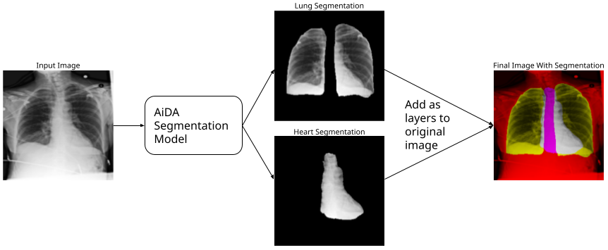

### Jake Ryan

## What is this?

This website aims to explain the project of its namesake. It involves deep learning (a form of machine learning commonly referred to as Artificial Intelligence) for the purpose of predicting whether chest radiographs (X-Rays) contain [pulmonary edema](https://www.mayoclinic.org/diseases-conditions/pulmonary-edema/symptoms-causes/syc-20377009). This site expects readers to have a basic familiriaty of what deep learning is and will explain the work with this idea in mind. However, any confusing terminology of this site can quickly be explained by a quick google search.

## Why Deep Learning for Medical Imaging?

Medical imaging is costly and can take a lot of time to get results, as a specialist must analyze each image to determine what, if anything, is present. Because of this, there has been large strides to bring deep learning to medical imaging. [Massive amounts of progress](https://www.thelancet.com/journals/landig/article/PIIS2589-7500(20)30160-6/fulltext) has been made, and there are many models that have fantastic levels of accuracy for determining what is present in a medical image.

Unfortunately, in order to train these models in the first place, researchers need access to thousand if not millions of high resolution medical images with their proper specialist given labels. The process of collecting a dataset like that is, of course, costly and time consuming (a cyclical issue).

### An Brief Explanation of the Paper "Deep Learning Radiographic Assessment of Pulmonary Edema: Optimizing Clinical Performance, Training With Serum Biomarkers"

<figure>

<figcaption><a href="https://www.researchgate.net/publication/360388931_Deep_Learning_Radiographic_Assessment_of_Pulmonary_Edema_Optimizing_Clinical_Performance_Training_With_Serum_Biomarkers">AiDA Lab's Biomarkers for CNN Training Paper</a></figcaption>
</figure>

This paper was written by members of Augmented imaging/Artificial intelligence Data Analytics (AiDA) Lab, headed by Dr. Albert Hsiao. The findings are significant: models trained on chest radiographs to predict NT-proBNP (BNPP), a protein found in a blood serum test, levels performed very well. What does this mean? Well, BNPP levels are [highly correlated with pulmonary edema](https://www.ncbi.nlm.nih.gov/pmc/articles/PMC3106101/), so much so that the levels of the protein found in the blood test are a biomarker of the condition. So, just by looking at XRays, where the pulmonary edema is either present or not, models were able to effectively predict BNPP levels. This then begs the question "Can models trained to infer BNPP levels accurately predict the presence of pulmonary edema?"

reexplain this section starting so just by looking at

### Why Does It Matter If This Model Works?

If a model trained solely to infer the presence of pulmonary edema from chest XRays by utilizing a threshold of BNPP value and could generalize to perform well on radiologist confirmed pulmonary edema XRays, there would be less of a need to have radiologist labeled XRays in the first place. This utilization of biomarkers for the training process here (if successful) could set the stage for other medical imaging models to do the same. Moving towards biomarkers for ground truth levels would decrease the cost and time of acquiring large enough datasets for future experiments.

## The Experiments

### The Data

#### UCSD Data
'UCSD' Data is set of about 16,000 chest radiographs. Rather than having radiologist confirmed for whether the XRay contains pulmonary edema, the dataset (from AiDA Lab's paper) contains only BNPP values. If the BNPP values is over a threshold of 400 pg/mL, the XRay was labeled as if it did contain pulmonary edema. Otherwise, it was labeled as if it did not.

	
UCSD Data Statistics

	The threshold of 400 pg/mL was recommended by AiDA labs. The STATS. The dataset is then split into train and validation sets with splits equal to 80% and 20%, respectively.

#### MIMIC Data
'MIMIC' Data comes from MIT's MIMIC-CXR public dataset, a project to provide anonymized chest radiographs and their respective medical results to the deep learning/medical imaging community. From this set, about 22,000 images were utilized. A portion of the MIMIC set is witheld and used as the test set all models were evaluated on.

	
MIMIC Data Statistics

	The STATS. The dataset is then split into train, validation, and test sets with splits equal to 80%, 10%, and 10%, respectively.

### Anatomical Segmentation
There's an entire class of deep learning models called segmentation models. They are used to segment out a portion of the image. These are already incredibly popular; Apple photos uses it as part of the image cutout feature.

<figure>

<figcaption><a href="https://support.apple.com/en-us/HT213459">Example of Image Segmentation Used By Apple</a></figcaption>
</figure>

Using a segmentated image can help focus a classification model on the important aspects of the image by reducing the noise the model has to look at. Fortunately, AiDA Labs provided their anataomical segmentation model. All images are run through this model, providing an individual image of just the heart and an individual image of just the lungs. Using these focused images could improve model proficiency.

### The Hypotheses

1.  Deep learning models trained to infer the presence of pulmonary edema from chest XRays and BNPP levels (UCSD Data) rather than radiologist diagnoses will generalize to unseen data with radiologist diagnoses provided by MIMIC-CXR.

2. A deep learning model that emphasizes anatomic structures will perform better than one that is not informed. This will be evaluated by training two models for each dataset, two provided and tested on lung-and-heart segmentations as additional input channels and two without.

## The Models

There are four models: a model trained with full images and biomarker-based labels (UCSD Full), a model trained with full images and radiologist confirmed labels (MIMIC Full), a model trained with anatomically segmented images and biomarker-based labels (UCSD Segmented), and a model trained with anatomically segmented images and radiologist confirmed labels (MIMIC Segmented).

Each model is based on a ResNet 152v2 with pretrained weights from the ImageNet dataset. 

*   example of ResNet model architecture*

What is ResNet 152v2 and what is ImageNet?

 

The ResNet 152v2 is an image classification model built by Microsoft that is renowned for its use of 
<a href="https://towardsdatascience.com/what-is-residual-connection-efb07cab0d55">residual connections</a>, a technique that allows networks to have a large amount of layers without losing its ability to predict.

ImageNet is an industry standard dataset often used to benchmark classification model performance. Models trained to perform on ImageNet have developed a feature space that is adept at predicting many different classes of things that may be in the image. It is a great 'starting place' for models trained on niche tasks, like this one.

 

## Biomarkers Work (or Biomarkers Do Not Work (Yet))

Mix of word explanation of results with tables, graphs, images, code, and saliency

|  | UCSD-Trained Full | MIMIC-Trained Full | UCSD-Trained Segmented| MIMIC-Trained Segmented |
| :---        |    :---:     | :---:  | :--: |  :--: | :--: |
| **AUROC** |0.755 | 0.877 | 0.754 | 0.889 |
| **PRC** | 0.590 | 0.799 | 0.559 | 0.816 |
| **Accuracy** | 0.652 | 0.793 | 0.616 | 0.802 |

